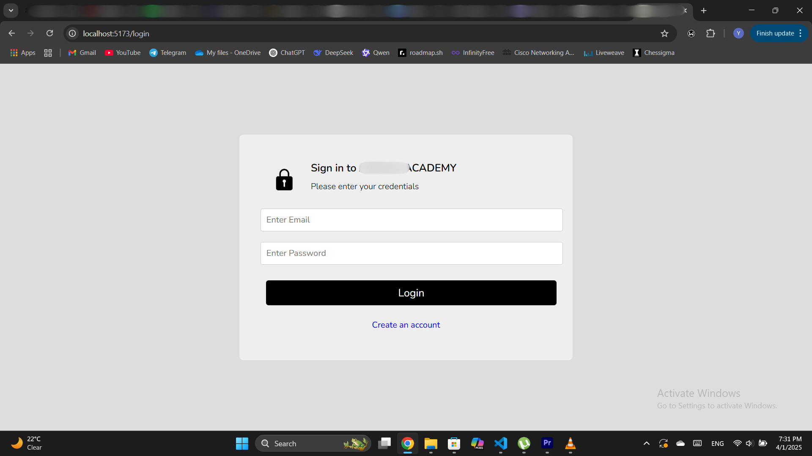
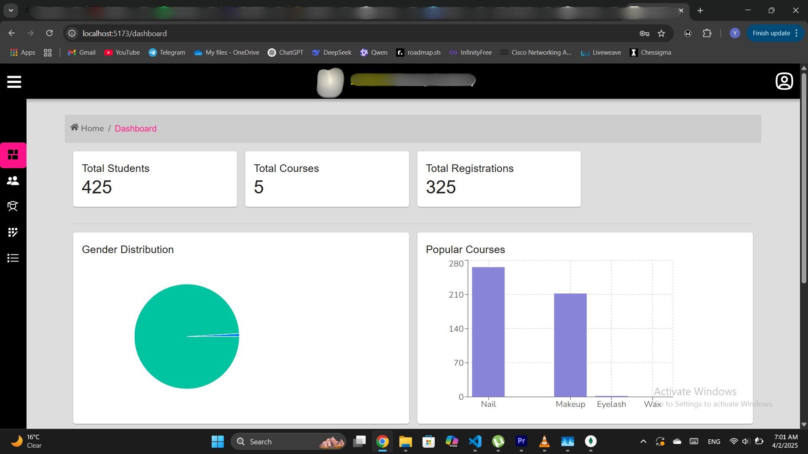
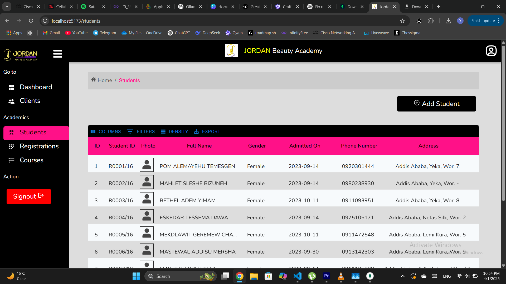
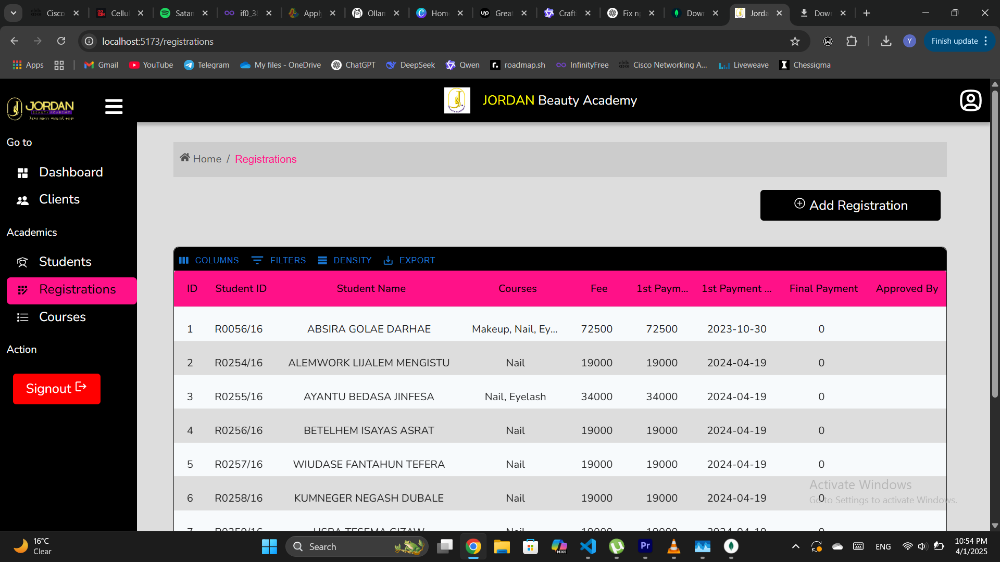
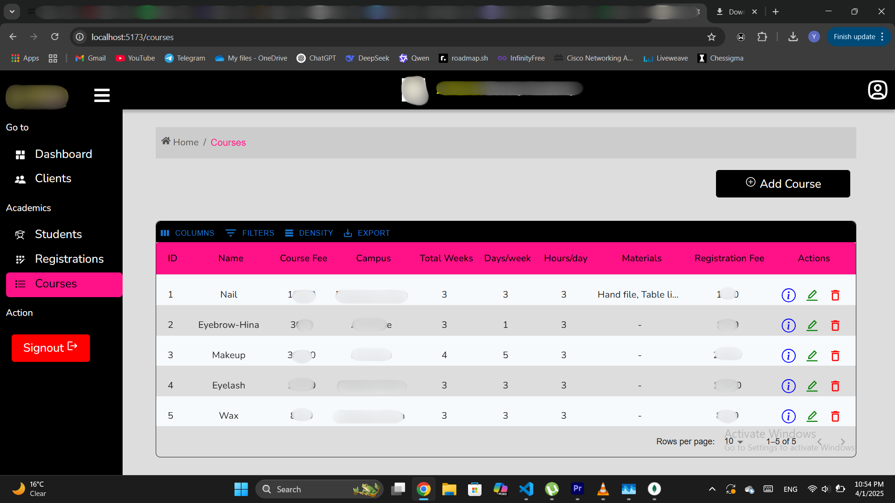
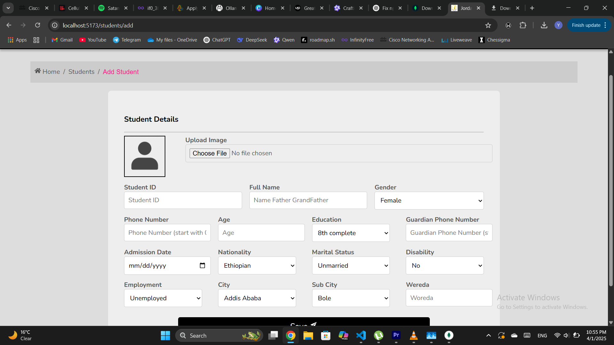
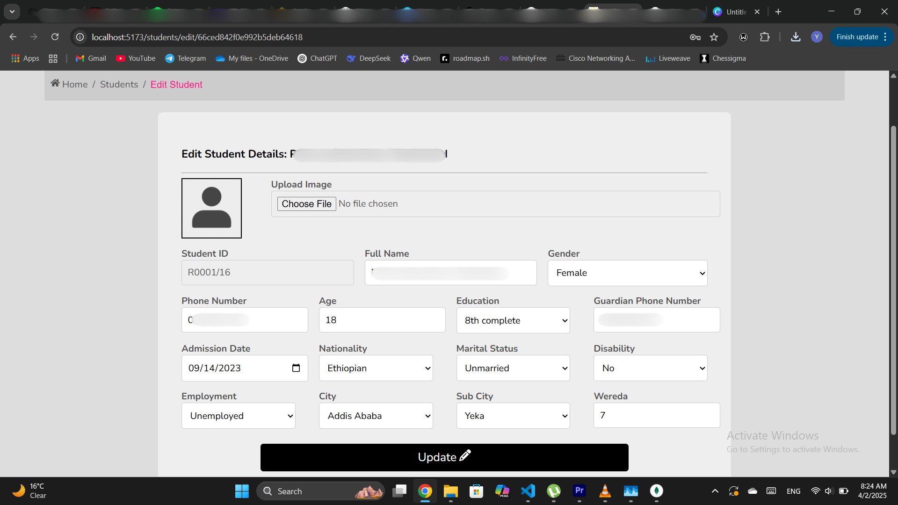

# School Management System (MERN Stack)

## 📌 Project Overview
This **School Management System** is a full-stack **MERN application** that allows users to manage students, registrations, and courses efficiently. It provides CRUD operations for each entity and includes authentication using **JWT**.

## 🚀 Features
- **User Authentication**: Secure login with **JWT authentication**.
- **Dashboard**: Displays analytical insights like total students, registrations, and courses with **charts**.
- **Students Management**: Add, view, edit, and delete students.
- **Registrations Management**: Manage student course registrations.
- **Courses Management**: Add, update, and remove courses.
- **Responsive UI**: Designed for both desktop and mobile devices.

## 🖼️ Screenshots
### 🔑 Login Page

### 📊 Dashboard

### 📋 Students Page

### 📝 Registrations Page

### 📚 Courses Page

### ➕ Add Student Page

### ✏️ Edit Student Page

## 🏗️ Tech Stack
- **Frontend**: React.js, Tailwind CSS
- **Backend**: Node.js, Express.js
- **Database**: MongoDB (Mongoose)
- **Authentication**: JWT (JSON Web Tokens)

## 🛠️ Installation & Setup
